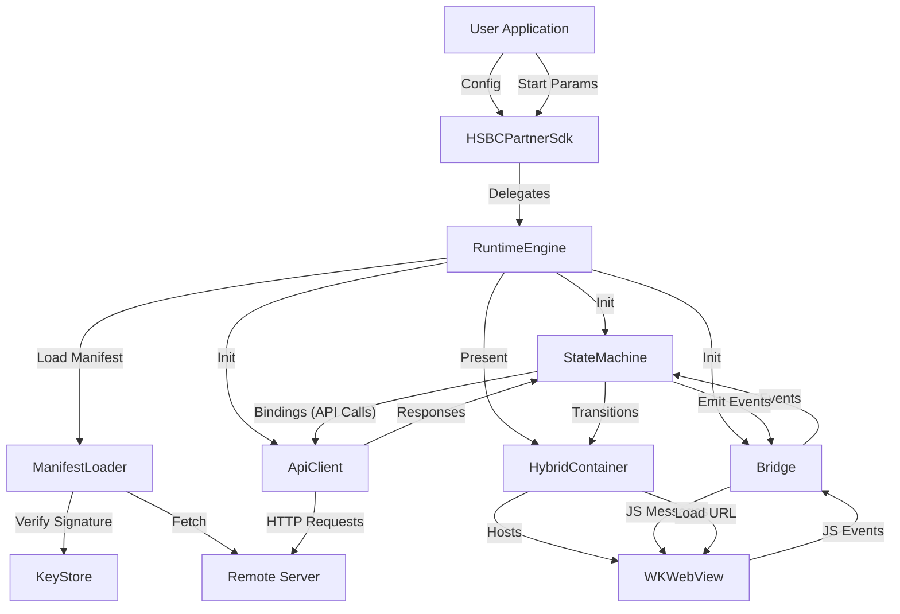
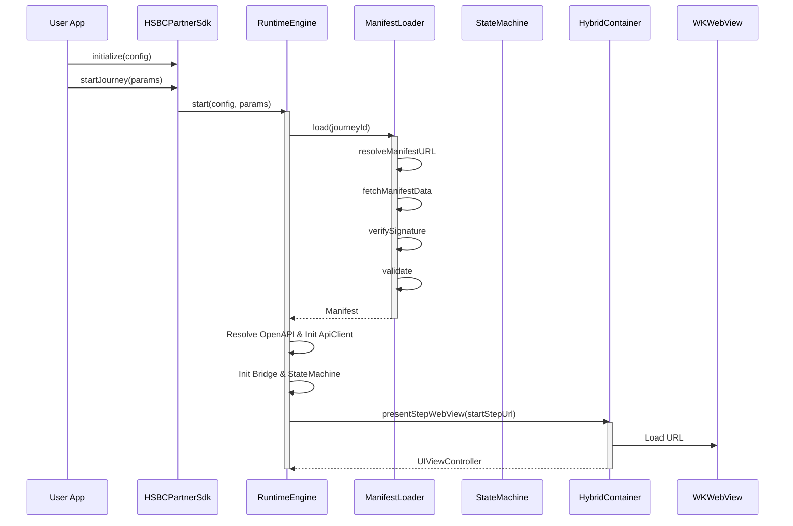
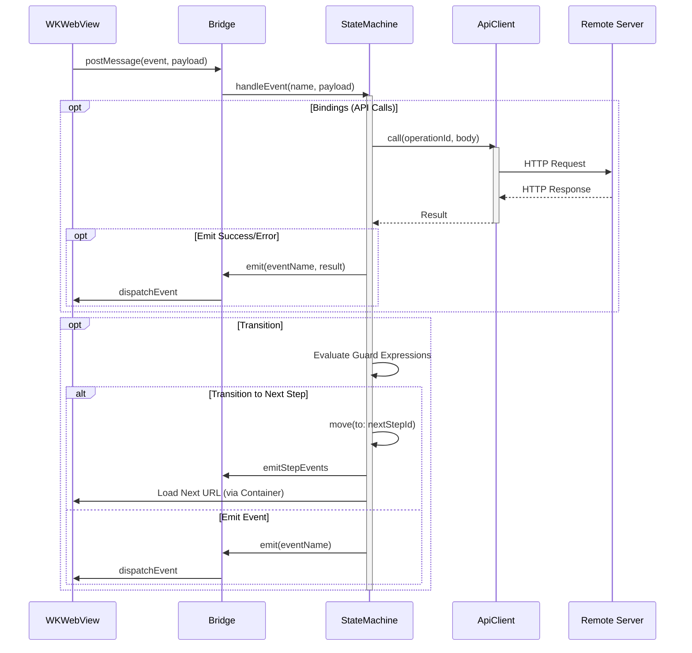

# HSBC Partner SDK - Data Flow and Sequence Diagrams

## Data Flow Diagram

This diagram illustrates how data moves through the SDK components.

## Sequence Diagram: Start Journey

This diagram shows the sequence of operations when starting a journey.

## Sequence Diagram: Event Handling & Transition

This diagram shows how events from the web view are handled and lead to transitions.

